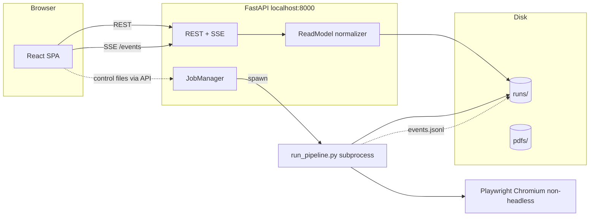

# ASV Frontend — Plan & Structure

Status: **partially implemented** — the API (`api/`) and web frontend (`web/`) both exist and
follow this spec; treat this document as the design reference (code comments cite it by section
number), not as a to-do list. Sections still describe the intended end state; not every phase is
complete.
Scope: a web UI over the existing ASV pipeline (`scripts/run_pipeline.py` → `runs/{pdf_stem}__{timestamp}/`).

---

## 1. Why a frontend

ASV currently produces its answer as four JSON files plus a log. Reading them means
hand-joining `ClaimObject`s from `citations/{stem}_claims.json` against
`ValidationResult`s spread across two different container shapes, then cross-referencing
`text_sources/_manifest.json` to understand *why* something failed. That join is the
actual product, and today a human does it in a text editor.

Concretely, from the most recent observed run (`runs/hsv_cancer__20260706_192057`):

| Group | Claims | Passed | Avg confidence |
|---|---|---|---|
| qualitative_uncited | 233 | 207 | 0.886 |
| quantitative_uncited | 14 | 10 | 0.643 |
| qualitative_cited | 45 | 6 | 0.191 |
| quantitative_cited | 14 | 1 | 0.071 |

The cited groups fail overwhelmingly, and the failures are dominated by
`"Batch failed: text source download unsuccessful"` — a *source acquisition* problem,
not a *verification* problem. So the frontend's primary job is not "show verdicts."
It is:

1. **Triage** — separate "the claim is unsupported" from "we never got the source."
2. **Intervene** — let a human supply a URL/PDF or complete a paywall login, then re-run
   just that batch.
3. **Trace** — for any claim, show the full chain: paper span → citation → resolution
   cascade → retrieved evidence → verdict.
4. **Operate** — start runs, watch them live, compare runs over time.

Ranking those four honestly matters, because it means a read-only results viewer is only
about a third of the value.

---

## 2. What the frontend has to work with

Everything is already on disk, owned by `RunPaths` (`run_paths.py`). No database exists.

```
runs/{pdf_stem}__{YYYYMMDD_HHMMSS}/
├── citations/{stem}_claims.json      # {claims: [...], citations: {...}, summary: {...}}
├── sourcefinder/found_datasets.json
├── sourcefinder/found_text_sources.json
├── generated_scripts/validate_{claim_id}.py
├── datasets/_manifest.json           # SourceManifestEntry[] — survives file cleanup
├── text_sources/_manifest.json       # SourceManifestEntry[] — survives file cleanup
├── validation_results/*.json         # 4 files, TWO different shapes (see below)
├── final_output/run_summary.json
└── logs/orchestration.log
```

### 2.1 The shape trap

The four result files are **not** homogeneous:

| File | Shape |
|---|---|
| `qualitative_uncited_results.json` | `List[ValidationResult]` |
| `quantitative_uncited_results.json` | `List[ValidationResult]` |
| `qualitative_cited_results.json` | `List[ValidationBatch]` |
| `quantitative_cited_results.json` | `List[ValidationBatch]` |

`ValidationBatch` wraps `claim_results: List[ValidationResult]` plus the batch-level
`download_successful`, `source_url`, `resolution_attempts`, `batch_notes`.

The frontend must never see this split. The backend flattens both into one
`ClaimRow` read model (§5.2) and keeps the batch context as a nested object.

### 2.2 Useful fields already present

- `ClaimObject.location_in_text` → `{start, end, chunk_id}`, absolute char offsets into
  the extracted PDF text. This is what makes in-document highlighting possible.
- `ClaimObject.is_original` / `originally_uncited` / `found_source` → routing provenance.
- `ValidationBatch.resolution_attempts` → `ResolutionAttempt[]` with
  `source` in `{direct, open_access, found_dataset, institutional_cookies, browser}`.
- `SourceManifestEntry` → survives the post-batch file deletion, carries
  `raw_citation_text`, `winning_url`, `format`, timestamps.
- `run_summary.json` → per-step elapsed/count/passed/failed/avg_confidence.

### 2.3 Gaps the frontend needs and does not have

- **No run index.** Runs are discovered by globbing `runs/`.
- **No machine-readable progress.** Progress exists only as human prose in
  `orchestration.log` (`logger.info("  Validating: claim_0_8")`).
- **No cost surface.** `llm_client.py` tracks token cost when `ENABLE_COST_TRACKING`,
  but nothing is written to the run folder.
- **No per-claim source text snapshot.** Downloaded PDFs/HTML are deleted after each
  batch (by design, to conserve disk). Retrieved RAG chunks are not persisted either, so
  "show me the evidence" currently has nothing to show beyond
  `ValidationResult.explanation`.

---

## 3. Constraints that shape the design

These are derived from the code, not assumed. Each one forces a specific decision.

**C1 — Runs are long and synchronous.** The observed run took 766s wall clock
(`total_elapsed_seconds`). `ClaimOrchestrator.process_claims()` is one blocking call.
→ The API cannot run a pipeline inside a request. Needs a job runner + polling/streaming.

**C2 — The pipeline blocks on `input()`.** `_setup_browser_searcher`
(`orchestrator/claim_orchestrator.py:218`) prints instructions and calls bare `input()`,
waiting for the user to finish logging in to paywalled domains in a **non-headless local
Chromium window**. A browser UI has no stdin.
→ This is the single biggest blocker. See §8.

**C3 — Playwright drives a real local browser.** The login handoff is inherently
machine-local. A remotely-hosted frontend cannot show the user that Chromium window.
→ Ship as a **localhost app** first (backend on the same machine as the browser).
Remote/multi-user is explicitly out of scope for v1.

**C4 — Source files are deleted after each batch.** `source_path` in the results points
at a file that no longer exists.
→ The UI must read `_manifest.json` for source metadata and must not offer "open the
downloaded source" unless retention is added (§9, B4).

**C5 — Offsets are into extracted text, not PDF coordinates.** `location_in_text` indexes
the string PyPDFLoader produced, which does not map 1:1 to any PDF text layer offset.
→ Highlighting needs a resolver step (§7).

**C6 — Reruns are all-or-nothing.** `scripts/run_orchestrator.py <claims_json> [run_dir]`
can re-orchestrate existing claims, but there is no per-batch entry point.
→ "Retry this citation" requires a new backend function (§9, B5).

---

## 4. Stack

| Layer | Choice | Rationale |
|---|---|---|
| Backend | **FastAPI** + uvicorn | Reuses `models.py` Pydantic v2 models directly as response schemas; auto-generates OpenAPI → typed TS client. No second schema definition. |
| Job runner | **subprocess + JSONL event file** (v1) | Keeps `run_pipeline.py` working unchanged as a CLI. The run folder stays the source of truth, consistent with the `RunPaths` philosophy. No Celery/Redis dependency. |
| Streaming | **SSE** (`text/event-stream`) | One-directional server→client; simpler than WebSockets and enough for logs + progress. Upgrade to WS only if bidirectional control is needed. |
| Frontend | **React + TypeScript + Vite** | Standard, fast dev loop, no SSR requirement. |
| Data fetching | **TanStack Query** | Polling, cache invalidation, and background refetch for a live run are exactly its job. |
| Routing | **React Router** | |
| Styling | **Tailwind + shadcn/ui** | Dense data tables, dialogs, and drawers without hand-rolling. |
| Tables | **TanStack Table** | 300+ claims needs virtualization, column filters, faceted counts. |
| PDF | **react-pdf** (pdf.js) | Custom text-layer renderer for highlight overlays. |
| Charts | **Recharts** | Small surface: confidence histogram, per-step timing bars. |

Rejected: Streamlit (can't do the claim↔PDF highlight interaction or a real job model);
Next.js (no SSR need for a localhost single-user tool, adds a Node server for nothing).

---

## 5. Architecture



### 5.1 The event/control contract

Two new files per run, both inside the run folder:

**`logs/events.jsonl`** — one JSON object per line, appended by the pipeline via a
logging handler. This is the machine-readable progress channel that §2.3 says is missing.

```jsonc
{"ts":"2026-07-06T19:22:12.9Z","type":"run_started","total_claims":306}
{"ts":"...","type":"step_started","step":"qualitative_cited","count":45}
{"ts":"...","type":"batch_started","step":"qualitative_cited","citation_id":"108","num_claims":3}
{"ts":"...","type":"resolution_attempt","citation_id":"108","url":"https://...","source":"open_access","downloaded":true}
{"ts":"...","type":"claim_validated","claim_id":"claim_0_9","passed":false,"confidence":0.0}
{"ts":"...","type":"awaiting_login","domains":["nature.com","sciencedirect.com"]}
{"ts":"...","type":"step_finished","step":"qualitative_cited","elapsed_seconds":397.63}
{"ts":"...","type":"run_finished","total_elapsed_seconds":766.26}
```

**`control/`** — the API writes here, the pipeline polls. v1 needs exactly one signal:
`control/login_ack.json`, which replaces the `input()` call.

Rationale for a file-based contract over an in-process callback: it costs one small module
on the Python side, keeps the CLI path identical, survives an API restart mid-run, and
makes the whole thing debuggable with `tail -f`.

### 5.2 Normalized read model

The backend computes this; the frontend never parses the raw four files.

```ts
type Verdict = 'passed' | 'failed' | 'unresolved_source' | 'skipped';

interface ClaimRow {
  claimId: string;
  text: string;
  claimType: 'quantitative' | 'qualitative';
  group: 'qual_uncited' | 'quant_uncited' | 'qual_cited' | 'quant_cited';
  isOriginal: boolean;
  originallyUncited: boolean;

  citation: {
    id: string | null;
    marker: string | null;          // "[12]"
    rawText: string | null;         // full bibliography line, from the manifest
    details: CitationDetails | null;
  } | null;

  locationInText: { start: number; end: number; chunkId: number } | null;

  result: {
    verdict: Verdict;
    passed: boolean;
    confidence: number;
    method: string;                 // rag_search | python_script | not_checkable
    explanation: string;
    errors: string | null;
    sourcesUsed: string[];
    validatedAt: string;
  } | null;

  batch: {                          // null for uncited groups
    citationId: string;
    downloadSuccessful: boolean;
    winningUrl: string | null;
    format: string | null;
    resolutionAttempts: ResolutionAttempt[];
    notes: string;
    siblingClaimIds: string[];
  } | null;

  generatedScriptPath: string | null;  // quant dataset-backed only
}
```

`verdict` is the key derived field. `passed` alone conflates two very different states:

- `unresolved_source` — `batch.downloadSuccessful === false`. **Not the paper's fault.**
  Actionable by a human.
- `failed` — a source was obtained and the claim did not hold up. The real finding.

Splitting these turns the 39/45 qual-cited "failures" above into an honest number.

---

## 6. Screens

### S1 — Runs index (`/`)
Table of every folder under `runs/`, parsed via `RunPaths.from_existing`.
Columns: paper, timestamp, status (running / complete / failed / awaiting-login),
claims, pass rate, unresolved-source rate, elapsed, cost.
Actions: **New run** (upload or pick from `pdfs/`), open, delete, compare two runs.

### S2 — Run overview (`/runs/:runId`)
- Header: paper name, timestamp, status pill, total elapsed.
- Four step cards from `run_summary.json` (count / passed / failed / avg confidence / elapsed).
- **Verdict breakdown** stacked bar: passed / failed / unresolved_source, per group.
  This is the chart that makes the source-acquisition problem visible immediately.
- Confidence histogram.
- **Source-resolution funnel**: citations total → URL found → downloaded → text extracted →
  validated. Built from `_manifest.json` + `resolution_attempts`. Shows exactly where the
  cascade leaks.
- Live mode: when the run is in-flight, this page subscribes to SSE and fills in
  progressively instead of showing a spinner.

### S3 — Claims explorer (`/runs/:runId/claims`)
The workhorse. Virtualized TanStack Table over `ClaimRow[]`.
- Faceted filters: group, verdict, claim type, confidence range, method, citation id,
  `is_original`, `originally_uncited`.
- Full-text search across claim text and citation raw text.
- Row expands to an inline evidence panel; clicking opens S4.
- Bulk action: select all `unresolved_source` rows → **Retry selected citations**.
- Export filtered set to CSV/JSON.
- Filter state is encoded in the URL so a view is shareable/bookmarkable.

### S4 — Claim detail (`/runs/:runId/claims/:claimId`)
Three panes, as a drawer over S3 or a full page:
1. **Claim** — text, type, routing badges, verdict, confidence gauge, method,
   `explanation`, `errors`.
2. **Source chain** — the citation's raw bibliography line, then the ordered
   `resolution_attempts` as a vertical stepper (url · source label · pass/fail · error).
   This is the "why did this fail" view and should be the default-open pane for
   `unresolved_source` claims.
3. **Evidence** — retrieved RAG chunks with similarity scores (requires B3); or, for
   dataset-backed quant claims, the generated script from `generated_scripts/` with syntax
   highlighting plus its stdout/exit code.

Sibling claims sharing the batch are listed, since they share a fate.

### S5 — Paper view (`/runs/:runId/paper`)
The original PDF with claim spans highlighted, colored by verdict. Click a highlight →
S4 drawer. Sidebar lists claims in document order and scroll-syncs. See §7.

### S6 — Sources (`/runs/:runId/sources`)
One row per `SourceManifestEntry` across both manifests. Columns: citation, title, winning
URL, format, attempts, batch size, outcome. Filter to failures. Per-row: **provide a URL**
or **upload a PDF** and re-validate that batch.

### S7 — Live run console (`/runs/:runId/console`)
Streamed `orchestration.log` (raw tail) alongside a structured event timeline from
`events.jsonl`. Step progress bars. The **awaiting-login banner** (§8) surfaces here and
as a global toast.

### S8 — Compare (`/compare?a=..&b=..`)
Two runs of the same paper side by side. Per-claim verdict deltas. Answers "did the
`TextDownloader` change actually help?" — currently answered by diffing JSON by hand.

---

## 7. PDF highlighting (S5)

`location_in_text` gives char offsets into the extractor's text, not PDF geometry (C5).
Bridging that is the one genuinely non-trivial frontend feature.

**Approach — server-side offset→rect resolution:**

1. New endpoint re-opens the PDF with **PyMuPDF** (already a dependency, `PyMuPDF==1.25.1`).
2. Walk `page.get_text("words")` per page, concatenating with the same joining rule the
   extractor used, to build a running char cursor → `(page, rect)` index.
3. For each claim span, collect the covered word rects and merge them into per-line quads.
4. Return `{claimId, page, quads: [[x0,y0,x1,y1], ...]}` normalized to page size.
5. Frontend overlays absolutely-positioned divs on the pdf.js text layer.

**Validation risk:** step 2 assumes PyMuPDF's word order/joining reproduces the
PyPDFLoader text the offsets were computed against. It probably does not, exactly.
Two mitigations, in order:

- Preferred: **persist the extracted text** the offsets refer to
  (`citations/{stem}_text.txt`, backend change B2) and fuzzy-anchor each claim's substring
  into the PyMuPDF word stream with `rapidfuzz` (already a dependency).
- Fallback: ignore offsets and use `page.search_for(claim_text[:80])`. Cheap, works for
  verbatim claims, fails on LLM paraphrases — which is precisely when `location_in_text`
  is already `null` anyway.

Ship the fallback first, upgrade to the anchored index once B2 lands. Highlighting must
degrade gracefully: a claim with no resolvable quads simply isn't highlighted, and the
sidebar still lists it.

---

## 8. The paywall login handoff (C2)

Today `_setup_browser_searcher` prints to stdout and blocks on `input()` at
`orchestrator/claim_orchestrator.py:218`. With the pipeline as a subprocess, stdin is not
a human.

**Design:**

1. `ClaimOrchestrator.__init__` takes an optional `interaction: InteractionHandler`.
2. Default (`ConsoleInteractionHandler`) preserves today's exact behavior — the CLI does
   not regress.
3. New `FileInteractionHandler(run_paths)`:
   - emits `{"type":"awaiting_login","domains":[...]}` to `events.jsonl`
   - polls `control/login_ack.json` every 500 ms until it appears (or times out)
4. The API exposes `POST /api/runs/{id}/login-complete`, which writes that file.
5. The UI shows a blocking banner: *"Chromium has opened on this machine. Log in to
   nature.com, sciencedirect.com, then click Continue."* Continue → the POST.

Because Playwright runs non-headless on the server machine (C3), the banner must state
plainly that the browser window is on the machine running the backend. For v1
(localhost) that is the user's own screen.

Timeout: default 15 min, then emit `login_timeout` and proceed without cookies rather
than hanging a job forever.

---

## 9. Required changes to the existing Python

The frontend is mostly additive, but it does not work without these. Smallest first.

| # | Change | Files | Why |
|---|---|---|---|
| **B1** | `RunEventLogger` writing `logs/events.jsonl`; call it at each step/batch/claim boundary alongside the existing `logger.info` calls | new `run_events.py`, `orchestrator/claim_orchestrator.py` | machine-readable progress (§5.1) — nothing else here works without it |
| **B2** | Persist extracted PDF text to `citations/{stem}_text.txt` | `hybrid_citation_scraper/claim_extractor.py` | offsets in `location_in_text` are meaningless without the string they index (§7) |
| **B3** | Persist retrieved RAG chunks + similarity scores into `ValidationResult.validation_metadata` | `orchestrator/process_qualitative.py`, `validator/` | S4's evidence pane; `validation_metadata` is `null` in every observed result today |
| **B4** | Optional source retention flag (`ASV_KEEP_SOURCES=1`) skipping post-batch deletion | `orchestrator/claim_orchestrator.py` | lets S4 show the actual source; default stays "delete" (C4) |
| **B5** | `revalidate_citation(run_paths, citation_id, override_url=None)` entry point | `orchestrator/claim_orchestrator.py`, `scripts/` | per-batch retry for S3/S6 (C6) |
| **B6** | `InteractionHandler` abstraction replacing bare `input()` | `orchestrator/claim_orchestrator.py` | §8 |
| **B7** | Write cost/token totals into `final_output/run_summary.json` | `llm_client.py`, `_save_run_summary` | cost column on S1/S2 |
| **B8** | Emit `status.json` (`queued\|running\|awaiting_login\|complete\|failed`) | new, written by the job runner | S1 needs run status without inferring it from file presence |

B1, B6, B8 are the blocking set for Phase 1. The rest are per-feature.

---

## 10. Repo layout

```
ASV/
├── api/                       # NEW — FastAPI backend
│   ├── main.py                # app factory, CORS for localhost:5173
│   ├── deps.py
│   ├── routers/
│   │   ├── runs.py            # list/create/delete/status
│   │   ├── claims.py          # normalized ClaimRow queries
│   │   ├── sources.py         # manifest views, retry, URL override
│   │   ├── paper.py           # PDF bytes + highlight quads
│   │   └── events.py          # SSE
│   ├── services/
│   │   ├── run_registry.py    # glob runs/, parse via RunPaths.from_existing
│   │   ├── read_model.py      # the 4-file → ClaimRow[] normalizer (§5.2)
│   │   ├── job_manager.py     # subprocess lifecycle, status.json, control/
│   │   ├── event_stream.py    # tail events.jsonl + orchestration.log
│   │   └── pdf_highlights.py  # §7
│   └── schemas.py             # API-facing models; reuses models.py where possible
├── web/                       # NEW — React SPA
│   ├── src/
│   │   ├── api/               # generated OpenAPI client + query hooks
│   │   ├── routes/            # S1–S8, one file per screen
│   │   ├── components/
│   │   │   ├── claims/        # ClaimsTable, ClaimRow, VerdictBadge, ConfidenceGauge
│   │   │   ├── sources/       # ResolutionStepper, ManifestTable, SourceOverrideDialog
│   │   │   ├── paper/         # PdfViewer, HighlightLayer, ClaimSidebar
│   │   │   ├── run/           # StepCards, VerdictBreakdown, ResolutionFunnel
│   │   │   └── live/          # LogStream, EventTimeline, AwaitingLoginBanner
│   │   ├── hooks/             # useRunEvents (SSE), useClaims, useRunStatus
│   │   ├── lib/               # verdict derivation, formatting, filter state ↔ URL
│   │   └── types/             # generated from OpenAPI — never hand-written
│   └── vite.config.ts         # proxy /api → :8000
└── run_events.py              # NEW — B1
```

Frontend types are **generated** from the FastAPI OpenAPI schema
(`openapi-typescript`). Since those schemas derive from `models.py`, a Pydantic change
propagates to TypeScript in one command — no third place to keep in sync.

---

## 11. API surface

| Method | Path | Returns |
|---|---|---|
| `GET` | `/api/runs` | `RunSummaryRow[]` — folder scan + `status.json` + `run_summary.json` |
| `POST` | `/api/runs` | `{runId}` — body `{pdfPath}` or multipart upload; spawns the job |
| `GET` | `/api/runs/{id}` | run detail: summary, step timings, verdict breakdown, funnel |
| `DELETE` | `/api/runs/{id}` | removes the folder (confirm in UI) |
| `GET` | `/api/runs/{id}/claims` | `ClaimRow[]`; query params for filters/sort/paging |
| `GET` | `/api/runs/{id}/claims/{claimId}` | one `ClaimRow` + siblings + script source |
| `GET` | `/api/runs/{id}/sources` | merged dataset + text `SourceManifestEntry[]` |
| `POST` | `/api/runs/{id}/sources/{citationId}/retry` | body `{overrideUrl?}` → B5 |
| `GET` | `/api/runs/{id}/paper.pdf` | original PDF bytes |
| `GET` | `/api/runs/{id}/highlights` | `{claimId, page, quads[]}[]` → §7 |
| `GET` | `/api/runs/{id}/events` | **SSE**: `events.jsonl` tail + log lines |
| `POST` | `/api/runs/{id}/login-complete` | writes `control/login_ack.json` → §8 |
| `GET` | `/api/pdfs` | contents of `pdfs/` for the run-launcher picker |
| `GET` | `/api/compare?a=&b=` | per-claim verdict deltas → S8 |

Claims are served from a **cached, memoized** normalization keyed on run id + mtime of the
four result files, so a 306-claim table doesn't re-parse per request.

---

## 12. Phased delivery

**Phase 0 — Backend contract (no UI).**
B1 (`events.jsonl`), B8 (`status.json`), B6 (`InteractionHandler`). Verify the CLI still
behaves identically. This is the only phase that meaningfully touches pipeline internals.

**Phase 1 — Read-only viewer.**
FastAPI + `read_model.py` normalizer. Screens S1, S2, S3, S4. No job control, no live run:
point it at the eight existing `runs/` folders and make them legible. Ships value on day
one against historical data.

**Phase 2 — Run control + live.**
`job_manager.py`, SSE, S7 console, awaiting-login banner (§8). "New run" from S1.

**Phase 3 — Paper view.**
B2 + `pdf_highlights.py` + S5. Fallback search-based highlighting first.

**Phase 4 — Intervention.**
B4, B5 + S6 source overrides + per-batch retry + bulk retry from S3. This is where the
39/45 failure rate actually starts moving.

**Phase 5 — Evidence + comparison.**
B3 (RAG chunks), B7 (cost), S8 compare.

---

## 13. Testing

- **Backend:** pytest, consistent with the existing `pytest.ini` markers. Fixture set =
  the committed `runs/hsv_cancer__*` folders, which give real heterogeneous data
  (successful batches, failed batches, empty `resolution_attempts`, null
  `citation_details`). Golden-file tests on the normalizer: 306 claims in → 306
  `ClaimRow`s out, verdict counts matching `run_summary.json`.
- **Normalizer edge cases to pin explicitly:** claims present in `claims.json` but absent
  from every result file (dropped by routing); `ValidationResult`s whose `claim_id` has no
  matching `ClaimObject`; a citation appearing in both manifests.
- **Frontend:** Vitest + Testing Library for verdict derivation and filter logic;
  Playwright (already a dependency) for one end-to-end smoke run against a fixture folder.
- **Contract:** CI fails if the generated TS client drifts from the committed one.

---

## 14. Open questions

1. **Single-user localhost, or shared?** The plan assumes localhost (C3). Multi-user
   changes auth, the runs root, and makes the Playwright login handoff unsolvable as
   designed.
2. **Is `unresolved_source` a failure for reporting purposes?** It changes every headline
   number. The plan treats it as a third state; a stakeholder may want it counted as a
   failure.
3. **Retention default for downloaded sources (B4).** Keeping them makes S4 far better and
   costs disk — the current code deletes deliberately.
4. **Does a human edit verdicts?** i.e. is there a review/annotation layer where someone
   marks a claim "reviewed — model was wrong"? That implies persistent state outside the
   run folder (SQLite), which nothing in the current design has. Worth deciding before
   Phase 1, since it's the one requirement that would change the storage story.
5. **Upload PDFs, or only pick from `pdfs/`?** Upload needs a size/type guard and a
   destination convention.
